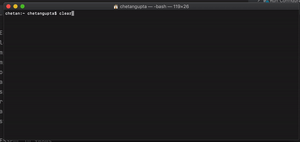

<h1 align="center"><a href="https://chetangupta.net/bbk-main" target="_blank">Big-Brain-Kotlin</a>
</h1>

## :hand: About
Hola Amigos! 🙌, welcome to my coding playground! you are welcome to explore around 👩‍💻 

Do let me know if you find something useful or want to suggest some improvement
also don't forget to checkout of blogs at [`chetangupta.net`](https://chetangupta.net/)

I also have special [`Big-Brain-Kotlin Series`](https://chetangupta.net/bbk-main) on going which teaches Kotlin stdlib, for solving problems.
This Application logic comes from the same place

|       |  |
| ----------- | ----------- |
| Series      | [Big-Brain-Kotlin](https://chetangupta.net/bbk-main)       |
| Logic   | [The Morse Code](https://chetangupta.net/bbk6)        |

## :eyes: Social
[LinkedIn](https://bit.ly/ch8n-linkdIn) | 
[Medium](https://bit.ly/ch8n-medium-blog) | 
[Twitter](https://bit.ly/ch8n-twitter) | 
[StackOverflow](https://bit.ly/ch8n-stackOflow) | 
[CodeWars](https://bit.ly/ch8n-codewar) |
[Portfolio](https://bit.ly/ch8n-home) |
[Github](https://bit.ly/ch8n-git) |
[Instagram](https://bit.ly/ch8n-insta) |
[Youtube](https://bit.ly/ch8n-youtube) 
 
# Morse Code Cli

Script that can encode a given message to Morse-Code or decode a given morse-code to message

### Preview
 

## :gear: How to Build

1. Run option `installDist` from gradle tab or from terminal run `./gradlew installDist`
2. From terminal navigate to `build/install/morse-code-cli-kt/bin` 
3. Run command `./morse-code-cli-kt` in terminal

## :wrench: Framework 
* CliKt for Scaffold
* Mordant for Colored Output
* Picnic for Tables 
* Inquirer for Argument parsing and Interactive Options

## :cop: License
Shield: [![CC BY-SA 4.0][cc-by-sa-shield]][cc-by-sa]

This work is licensed under a
[Creative Commons Attribution-ShareAlike 4.0 International License][cc-by-sa].

[![CC BY-SA 4.0][cc-by-sa-image]][cc-by-sa]

[cc-by-sa]: http://creativecommons.org/licenses/by-sa/4.0/
[cc-by-sa-image]: https://licensebuttons.net/l/by-sa/4.0/88x31.png
[cc-by-sa-shield]: https://img.shields.io/badge/License-CC%20BY--SA%204.0-lightgrey.svg