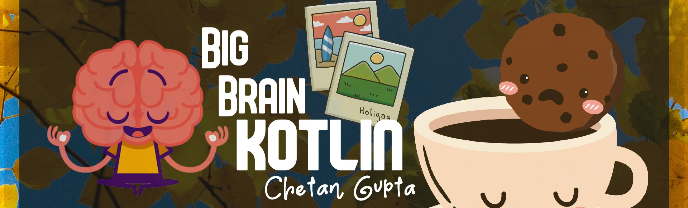

<h1 align="center"><a href="https://chetangupta.net/bbk-main" target="_blank">Big-Brain-Kotlin</a>
</h1>



# Morse Code Cli

Script that can encode a given message to Morse-Code or decode a given morse-code to message
---
## :gear: How to Build

1. Run command
```gradle
    ./gradlew installDist
```
2. Navigate to build/install/bin
```
// In terminal run command
./morse-code-cli-kt
```
---
## :wrench: Framework 
* CliKt for Scaffold
* Mordant for Colored Output
* Picnic for Tables 
* Inquirer for Argument parsing and Interactive Options

---
## :cop: License
```
   Copyright [2020] [Chetan gupta] [chetangupta.net]
   Licensed under the Apache License, Version 2.0 (the "License");
   you may not use this file except in compliance with the License.
   You may obtain a copy of the License at

     http://www.apache.org/licenses/LICENSE-2.0

   Unless required by applicable law or agreed to in writing, software
   distributed under the License is distributed on an "AS IS" BASIS,
   WITHOUT WARRANTIES OR CONDITIONS OF ANY KIND, either express or implied.
   See the License for the specific language governing permissions and
   limitations under the License.

 ```